- [Framework execution flow](#framework-execution-flow)
  - [Introduction](#introduction)
    - [Document structure](#document-structure)
    - [Eezze framework file structure](#eezze-framework-file-structure)
    - [Goals](#goals)
  - [1 Authentication](#1-authentication)
    - [1.1 Events](#11-events)
    - [1.2 Examples](#12-examples)
  - [2 Input validation](#2-input-validation)
    - [2.1 Events](#21-events)
    - [2.2 Examples](#22-examples)
  - [3 Pre-Hooks](#3-pre-hooks)
    - [3.1 Events](#31-events)
    - [3.2 Examples](#32-examples)
  - [4 Main](#4-main)
    - [4.1 Events](#41-events)
    - [4.2 Examples](#42-examples)
      - [Service calling](#service-calling)
      - [Repository actions](#repository-actions)
      - [Command line execution](#command-line-execution)
      - [Template rendering](#template-rendering)
      - [Send emails](#send-emails)
      - [Custom code](#custom-code)
      - [Action-chain](#action-chain)
  - [5 Post-Hooks](#5-post-hooks)
    - [5.1 Events](#51-events)
    - [5.2 Examples](#52-examples)
  - [6 Response](#6-response)
    - [6.1 Events](#61-events)
    - [6.2 Examples](#62-examples)
- [Framework flowchart](#framework-flowchart)
- [Questions and Answers](#questions-and-answers)
  - [What is a Decorator?](#what-is-a-decorator)
- [Addendum](#addendum)
  - [Eezze Decorators & Services](#eezze-decorators--services)
    - [Decorators](#decorators)
    - [Services](#services)
  - [Scenarios](#scenarios)
    - [Authentication](#authentication)
      - [Login](#login)
      - [Forget Password](#forget-password)
      - [Logout](#logout)
      - [Upload user avatar](#upload-user-avatar)
      - [Update account](#update-account)
    - [Local emailing service](#local-emailing-service)
      - [Send email](#send-email)

# Framework execution flow

## Introduction

### Document structure

The general event ordering for any `service` within the Eezze framework is as follows (with chapter numbers pre-fixed):

> For a detailed event flow breakdown, please see the last [chapter](framework-events.md#framework-flowchart).


This document explains the specific events (`Events` paragraph) for each of these steps with related `Decorator` examples (`Examples` paragraph).

### Eezze framework file structure

Every Eezze `project` follows the following file and directory structure to define `services`:

>Directory Structure \
📦src \
 ┗ 📂services \
 ┃ ┣ 📂serviceName \
 ┃ ┃ ┣ 📂operationName \
 ┃ ┃ ┃ ┣ 📂action \
 ┃ ┃ ┃ ┃ ┣ 📜action-input.ts \
 ┃ ┃ ┃ ┃ ┣ 📜index.ts \
 ┃ ┃ ┃ ┃ ┗ 📜model.ts \
 ┃ ┃ ┃ ┗ 📜service.ts \
 ┃ ┃ ┗ 📜controller.rest.ts \
 ┃ ┃ ┗ 📜config.yaml

Within your project's services, the `serviceName` indicates the name of a specific `service`, where `operationName` denotes the particular operation you'd like to have available for your users. 

> For example; The `service`, *facebook*, could have the `operationName`; *getMyFriendsEmailAddresses*. The directory structure for this `service` would be; `src/services/facebook/getMyFriendsEmailAddresses`.
 
The files relevant to the event flows explained in this document serve the following purpose;
- `.../service.ts` is the main service file, this contains the Authentication decorator (if any).
- `.../action/action-input.ts` provides parameter input definitions for this service, and the framework will use this to validate the input.
- `.../action/index.ts` represents the main action file,
- `.../action/model.ts` is the model action file.

### Goals

The goal of this document is to help understand; 
- all the `events` and the `decorators` available in the Eezze Framework that help simplify and automate code for every single `service`,
- when the `events` occur, 
- where the `decorators` can be used in the corresponding `events`, and how they can be used using examples.

## 1 Authentication

### 1.1 Events


### 1.2 Examples

To create an Authenticator service, we need an authenticator.ts file, which looks like this:

> `@EAuthenticator`is required to be set on the class that implements an authenticator.
> 
```javascript
@EAuthenticator()
export default class ExpressAuthenticationAuthenticator extends BaseAuthenticator {
    @JWTToken({
        serializeProperty: false,
        debug: false,
        additionalHeaders: {
            type: 'id-token'
        },
        map: (contexts: SetterContextI) => {
            if (contexts?.req?.urlParams?.authorization) {
                return contexts?.req?.urlParams?.authorization;
            }
            return contexts?.req?.requestHeaders?.authorization;
        },
    })
    authToken: string;

    @JWTTokenDecoded({
        serialize: (decoded: any, contexts: any) => {
            let token = contexts?.req?.urlParams?.authorization ?? contexts?.req?.requestHeaders?.authorization;
            contexts.req.auth.setUser(token, decoded);
            contexts.req.auth.setRoles(decoded.roles);
        },
    })
    authTokenDecoded ? : string;
}
```

Service can use a specific authenticator by specifying the name of the service using the `@EService` decorator:

```javascript
@EService({
    authenticator: 'ExpressAuthentication',
})
export default class GenAllControllersService extends BaseService {
    async run() {
        return await this.action.run()
    }
}
```

## 2 Input validation

### 2.1 Events

```mermaid
%%{init: {'theme':'base'}}%%
flowchart TB

subgraph validate["📜./action/action-input.ts"]
    direction TB
    3.Validate-->3.Serialize
end
```

### 2.2 Examples

To validate login information, we can use this example in the ``action-input`` file.

The decorators ``@Email``, ``@Password``, ``@String`` etc. are used to apply typing information to the ``requestBody`` parameters

```javascript
@EActionInput()
export default class LoginActionInput extends BaseActionInput {
    @Email({
        required: true,
        map: (context: SetterContextI) => context?.req?.requestBody?.email,
    })
    protected email: string;

    @Password({
        required: true,
        map: (context: SetterContextI) => context?.req?.requestBody?.password,
    })
    protected password: string;
}
```

## 3 Pre-Hooks

### 3.1 Events

```mermaid
%%{init: {'theme':'base'}}%%
flowchart TB

subgraph Pre-Action["📜./action/index.ts"]
    direction TB
    4.Action-PreExec["4: @PreExec()"]-->5.Action-WhenPre["5: @When({hook:'pre'})"]
end

subgraph Pre-ModelAction["📜./action/model.ts"]
    direction TB
    6.ModelAction-PreExec["6: @PreExec()"]-->7.ModelAction-WhenPre["7: @When({hook:'pre'})"]
end

Pre-Action-->Pre-ModelAction
```
### 3.2 Examples
 
 In case for specific role(s) you need to do pre execution verification

 ```javascript
@PreExec({
    roles: ['ROLE_ADMIN']
})
_prePersist(data: any) {
    // perform any pre execution checks for this ROLE
}
```

Or do an email is verified check before you return success to the user.

```javascript
@EModelAction({targetEntity: 'User'})
export default class VerifyEmailModelAction extends BaseModelAction {
  @When({
      hook: 'pre',
      condition: (payload: any) => (payload?.result?.userId ?? 0) > 0,
  })
  _setVerified(payload: any) {
      payload.payload.emailVerified = true;
  }
}
```

## 4 Main  

### 4.1 Events

```mermaid
%%{init: {'theme':'base'}}%%
flowchart TB

subgraph mainaction["📜./action/index.ts"]
    8.Action-Exec["8: _exec()"]
end

subgraph modelactionmain["📜./action/model.ts"]
    9.ModelAction-Exec["9: _exec()"]
end

mainaction-->modelactionmain
```

> 8. Run Action: `_exec()`, this is where we can perform ``action-chain`` activities or even database related activities such as `@GetOne`.This could be overridden by an action decorator or just a `@Run` decorator for custom code.

### 4.2 Examples

#### Service calling

Can call any registered service in this `project`. 

When `addToChain` is specified, there's one decorator before or after this decorator that will be executed in order.

```javascript
@ServiceCaller({
        service: 'ExpressAuthenticationService:updateAccount',
    payload: (data: any, req: E_REQUEST) => {
        return {
            headers: {
                authorization: req?.auth?.idToken,
            },
            requestBody: {
                userId: req?.auth?.user?.userId,
                avatar: data.successResult?.fileInfo?.fileName,
            },
        };
    }
})
```

#### Repository actions

These are the standard database operations supported out of the box:

| Name         | Function     |
|--------------|-----------|
| Retrieve all | `@GetAll()`      |
| Retrieve one      | `@GetOne({checkOn: ['email'], addToChain: true})`  |
| Create one      | `@CreateOne({ keyOn: 'key', addToChain: true })` |
| Create one if not exist      | `@CreateOneIfNotExists({checkOn: ['email', 'username'], addToChain: true})`  |
| Update one      | `@UpdateOne({ keyOn: 'key', addToChain: true })`  |
| Delete one      | `@DeleteOne()`  |

To execute custom repository code, `@RepoMethod()` function can contain custom queries that need to be defined in the `repository` file that corresponds to the `service`:

```javascript
@RepoMethod({
        method: 'saveUserAvatar',
})
```

To update a specific row, `@GetOneAndUpdate()` function can provide this functionality in a short format:

```javascript
@GetOneAndUpdate({
        checkOn: ['email'],
    withValues: (res: any) => ({
        resetPasswordToken: EezzeJwtToken.sign(res?.payload?.email, {
            minutes: 15
        }).token,
    }),
})
```

#### Command line execution

```javascript
@Command({
    rootFolder: process.env['PROJECTS_FILE_ROOT'] + '/${ userId }/${ projectId }',
    command: 'npm run wgen-till-kill > websocket-out.log'
})
```

#### Template rendering

We use `twing` to render Twig templates for instance to generate code, or it serves as an email template.

```javascript
@RenderTemplate({
        linter: 'json',
    templateName: 'project-package',
    toPath: `${process.env['PROJECTS_FILE_ROOT']}/\${ userId }/\${ projectId }/package.json`,
    templateVars: (payload: any, contexts: any) => ({
        name: payload?.name,
        description: payload?.description,
        author: `${contexts.request.auth?.user.firstName} ${contexts.request.auth?.user.lastName}`,
    })
})
```

#### Send emails

Any mail sending needs, this decorator takes care of that using Twig compatible templates:

```javascript
@EAction({
    targetRepo: 'SmtpMailService.Email'
})
export default class SendMailAction extends BaseAction {
    @SendSMTPEmail({
        template: (deps: any) => deps?.payload?.template,
        templateVars: (deps: any) => deps?.payload?.templateVars,
        message: (deps: any): MessageSchemaI => ({
            envelope: {
                to: deps?.payload?.to,
                from: deps?.payload?.from,
                fromFirstName: deps?.payload?.fromFirstName ?? undefined,
                fromLastName: deps?.payload?.fromLastName ?? undefined,
            },
            subject: deps?.payload?.subject ?? 'There was no subject supplied',
        }),
    }) async _exec() {}
}
```

consequently, templates can be defined as Twig templates, like so;

```twig
## Welcome to Eezze!

Dear. **{{ name }}** (**{{ username }}**)

Please click the link to verify your account. **[Verify Account]({{ host }}/auth/verify-email?token={{ token }})**

Thank you from the 
**Eezze Team**
```

this also requires a mail `datasource type` and `datasource` to be generated:

```javascript
@EDataSource({
    datasourceType: 'SmtpMailService',
    port: process.env['EMAIL_SERVICE_PORT'],
    secure: false,
    host: process.env['EMAIL_SERVICE_HOST'],
    auth: {
        user: process.env['EMAIL_SERVICE_EMAIL'],
        pass: process.env['EMAIL_SERVICE_PASSWORD'],
    },
})
export default class LocalSmtpService {}
```

#### Custom code

If nothing fits with the given decorators, the custom `@Run` can execute any code.

```javascript
@Run()
_run(results: any) {
    return {
        success: true,
        body: results.payload.refreshTokenDecoded,
    }
}
```

#### Action-chain
 
This is an example how the framework can stack multiple `actions` after one another that get executed from top to bottom by specifying the `addToChain: true` parameter.

```javascript
export default class CreateProjectAction extends BaseAction {
    @RepoMethod({
                method: 'createIfNotExistsProject'
    })
    @RenderTemplate({
                linter: 'yaml',
        templateName: 'project-config',
        toPath: `${process.env['PROJECTS_FILE_ROOT']}/\${ userId }/\${ projectId }/project-config.yaml`,
        templateVars: (payload: any, contexts: any) => ({
            projectId: payload?.projectId,
            name: payload?.name,
            description: payload?.description,
            industry: payload?.industry,
            author: `${contexts.request.auth?.user.firstName} ${contexts.request.auth?.user.lastName}`,
        })
    })
    async _exec() {}
}
```

## 5 Post-Hooks

### 5.1 Events

```mermaid
%%{init: {'theme':'base'}}%%
flowchart TB

 subgraph Post-ModelAction["📜./action/model.ts"]
            10.ModelAction-When["10: @When({hook:'post'})"]
            11.ModelAction-PostExec["11: @PostExec()"]
            13.ModelAction-When-PreAction["13: @When({hook: 'preActionConditions'})"]
end
subgraph Post-Action["📜./action/index.ts"]
    12.Action-PostExec["12: @PostExec()"]
    14.Action-When["14: @When({hook:'post'})"]
end

10.ModelAction-When-->11.ModelAction-PostExec-->12.Action-PostExec-->13.ModelAction-When-PreAction-->14.Action-When
```

### 5.2 Examples
 
 In the Model Action we can check if the username and password combination is correct:

 ```javascript
@PostExec()
_checkPassword(user: UserModel, payload: any) {
    if (!user.login(payload.payload.password)) {
        throw new UnauthResponse('Incorrect user credentials');
    }
}
```

In the Model Action, we need to make sure the account is verified before we can login to the account:

```javascript
@When({
    hook: 'preActionConditions',
    condition: (payload: any) => !payload?.entity?.emailVerified,
    onPassThrow: new UnauthResponse('Account not yet verified')
})
_accountIsntVerified() {}
```		

In the action

```javascript
@When({
    hook: 'post',
    condition: (results: any) => results?.success && results?.body?.userId > 0,
})
async _sendVeryifyEmail(res: any) {
    let results: any = await Service('ExpressAuthenticationService:sendVerifyAccountEmail', {
        requestBody: {
            email: res?.body?.email,
        }
    });

    if (!results.success) {
        throw `Could not send verify account email. Please contact site admin`;
    }
}
```

After the reset password request has been processed, we need to send an email with the details.

```javascript
@When({
    hook: 'post',
    condition: (res: any) => res?.body?.userId > 0,
})
async _sendForgotPassEmail(res: any) {
    let payload = {
        to: [res?.body?.email],
        from: process.env['EMAIL_SERVICE_FROM_EMAIL'],
        subject: 'Eezze Forgot Password ',
        template: 'forgot-password',
        templateVars: {
            resetPasswordUrl: 'http://localhost:8080/reset-password',
            username: res?.body?.username,
            name: `${res?.body?.firstName} ${res?.body?.lastName}`,
            token: EezzeJwtToken.sign({
                    userId: res?.body?.userId
                }, {
                    minutes: 5
                },
                '', {
                    type: 'reset-password'
                }
            ).token,
        },
    };

    let results: any = await Service('LocalEmailingService:sendMail', {
        requestBody: payload
    });

    if (!results.success) {
        throw `Could not send verify email password. Please contact site admin`;
    }
}
```

## 6 Response

### 6.1 Events

```mermaid
%%{init: {'theme':'base'}}%%
flowchart TB

subgraph response["📜./action/index.ts"]
    15.Success["15: @Success()"]
    15.Failure["15: @Failure()"]
end
```

### 6.2 Examples

If the login is a success, return JWT tokens:

```javascript
@Success()
async _success(res: any) {
    if (!res?.body) throw new InternalServerErrorResponse();

    res.body = EezzeJwtToken.getLoginTokens(res?.body);

    return new ActionResponse(res);
}
```
# Framework flowchart

When we consider all the events described above, the following logical flow is executed for every `service`.

```mermaid
%%{init: {'theme':'base'}}%%
flowchart TB

    subgraph 1.Authentication
        direction TB
        1.Authenticator-->2.Check-roles
    end

    subgraph 2.Input-validation
        subgraph validate["📜./action/action-input.ts"]
            direction TB
            3.Validate-->3.Serialize
        end
    end

    subgraph 3.Pre-Hooks
        direction TB
        subgraph Pre-Action["📜./action/index.ts"]
            direction TB
            4.Action-PreExec["4: @PreExec()"]-->5.Action-WhenPre["5: @When({hook:'pre'})"]
        end
        subgraph Pre-ModelAction["📜./action/model.ts"]
            direction TB
            6.ModelAction-PreExec["6: @PreExec()"]-->7.ModelAction-WhenPre["7: @When({hook:'pre'})"]
        end
        Pre-Action-->Pre-ModelAction
    end

    subgraph 4.Main
        subgraph mainaction["📜./action/index.ts"]
            8.Action-Exec["8: _exec()"]
        end
        subgraph modelactionmain["📜./action/model.ts"]
            9.ModelAction-Exec["9: _exec()"]
        end
        8.Action-Exec-->9.ModelAction-Exec
    end

    subgraph 5.Post-Hooks
        direction LR
        subgraph Post-ModelAction["📜./action/model.ts"]
            10.ModelAction-When["10: @When({hook:'post'})"]
            11.ModelAction-PostExec["11: @PostExec()"]
            13.ModelAction-When-PreAction["13: @When({hook: 'preActionConditions'})"]
        end
        subgraph Post-Action["📜./action/index.ts"]
            12.Action-PostExec["12: @PostExec()"]
            14.Action-When["14: @When({hook:'post'})"]
        end
        
        10.ModelAction-When-->11.ModelAction-PostExec-->12.Action-PostExec-->13.ModelAction-When-PreAction-->14.Action-When
    end
    
    subgraph 6.Response
        subgraph response["📜./action/index.ts"]
            15.Success["15: @Success()"]
            15.Failure["15: @Failure()"]
        end
    end

    1.Authentication-- authenticated --->2.Input-validation
    2.Input-validation-- input validated --->3.Pre-Hooks
    3.Pre-Hooks-- pre main hooks executed --->4.Main
    4.Main-- main methods executed --->5.Post-Hooks
    5.Post-Hooks-- post hooks executed --->6.Response

    classDef bold font-weight: bold;

    class 1.Authentication,2.Input-validation,3.Pre-Hooks,4.Main,5.Post-Hooks,6.Response bold;
```

# Questions and Answers

## What is a Decorator?

> A `Decorator` allows for a lot of code to be executed 'behind the scenes' to improve readability.

For example; the code below applies the type `Password` to the `requestBody` parameter `password` and makes it available under the `password` variable:

```javascript
@Password({
    required: true,
    map: (context: SetterContextI) => context?.req?.requestBody?.password,
})
protected password: string;
```

# Addendum

## Eezze Decorators & Services

All available operations in the Eezze framework either as a `decorator` or as a ready made `service`.

### Decorators

| Type         | Name         | Function     |
|--------------|--------------|-----------|
| Database | Retrieve all | `@GetAll()`      |
| Database | Retrieve one | `@GetOne({checkOn: ['email'], addToChain: true})`  |
| Database | Create one | `@CreateOne({ keyOn: 'key', addToChain: true })` |
| Database | Create one if not exist | `@CreateOneIfNotExists({checkOn: ['email', 'username'], addToChain: true})` |
| Database | Update one | `@UpdateOne({ keyOn: 'key', addToChain: true })`  |
| Database | Get one and update | `@GetOneAndUpdate()`  |
| Database | Delete one | `@DeleteOne()`  |
| Database | Custom database query | `@RepoMethod({ method: 'getSomethingWithRelationShipCustomer' })`  |
| Email | Send an email using an existing SMTP server | `@SendSMTPEmail()` |
| Integration | Call a WebService or Websocket channel | `@ServiceCaller()` |
| Custom code | Custom code execution block | `@Run()` |
| Template | Render a Twig compatible template for emails or code generation | `@RenderTemplate()` |
| Command-line | Execute command line programs      | `@Command()` |

### Services

> These services require a version prefix to the `Path`, e.g. `/v1/auth/forgot-password`. The version prefix is a per project specific configuration.

| Service         | Method | Path | Operation         | Description     |
|--------------|--------------|-----------|--------------|-----------|
| Authentication | `PUT` | `/auth/forgot-password` | `forgotPassword` | Forget password |
| Authentication | `GET` | `/auth/users` | `getUsers` | Retrieve registered users |
| Authentication | `POST` | `/auth/login` | `login` | Login user |
| Authentication | `PUT` | `/auth/token` | `refreshToken` | Renew authorization JWT tokens (ID and Refresh tokens) |
| Authentication | `POST` | `/auth/register` | `registerAuthUser` | Register a new user |
| Authentication | `DELETE` | `/auth/user` | `removeAuthUser` | Remove a registered user |
| Authentication | `PUT` | `/auth/reset-password` | `resetPassword` | Reset password |
| Authentication | `GET` | `/auth/user` | `retrieveAuthUser` | Retrieve a registered user |
| Authentication | `POST` | `/auth/send-verify-account-email` | `sendVerifyAccountEmail` | Send 'verify account' email |
| Authentication | `POST` | `/auth/user` | `updateAccount` | Update user data |
| Authentication | `GET` | `/auth/verify-email` | `verifyEmail` | Verify email address |
| GMail | `GET` | `/gmail/get-auth-code` | `getAuthCode` | Get OAuth2 authorization code from Google Auth |
| GMail | `GET` | `/gmail/get-auth-tokens` | `getAuthTokens` | Get OAuth2 authorization tokens from Google Auth |
| GMail | `GET` | `/gmail/get-auth-url` | `getAuthUrl` | Get OAuth2 authorization URL from Google Auth |
| GMail | `POST` | `/gmail/send-mail` | `sendGmail` | Send plain text or html formatted email via GMail |

## Scenarios

### Authentication

#### Login

```mermaid
%%{init: {'theme':'base'}}%%
flowchart TB

ActionInput[/"📜./action/action-input.ts

- email: res.requestBody.email
- password: res.req.requestBody"/]-->

Action{{"📜./action/index.ts

@GetOne: 
retrieve User with email from datasource"}}-->

PostExec{{"📜./action/index.ts

@PostExec: Check if credentials match
"}}-->

ModelAction{{"📜./action/model.ts

@When: preActionConditions: if email isn't verified we return `unAuthenticated`
"}}-->

Success{{"📜./action/index.ts

@Success: Return all the login tokens"}}

```

#### Forget Password

```mermaid
%%{init: {'theme':'base'}}%%
flowchart TB

ActionInput[/"📜./action/action-input.ts

- email: res.requestBody.email"/]-->

Action{{"📜./action/index.ts

@GetOne: 
retrieve User with email from datasource"}}-->

ModelActionPre{{"📜./action/model.ts

    @When: pre: check if email is verified
"}}-->

PostExec{{"📜./action/index.ts

@PostExec: send forget password email via Service call;
LocalEmailingService:sendMail
"}}-->

Success{{"📜./action/index.ts

@Success: returns action ok"}}

```

#### Logout

```mermaid
%%{init: {'theme':'base'}}%%
flowchart TB

ActionInput[/"📜./action/action-input.ts

- email: res.requestBody.email"/]-->

Action{{"📜./action/index.ts

@GetOne: 
retrieve User with email from datasource"}}-->

Success{{"📜./action/index.ts

@Success: Successfully logged out"}}

```

#### Upload user avatar

```mermaid
%%{init: {'theme':'base'}}%%
flowchart TB

ActionInput[/"📜./action/action-input.ts

- userId: res.requestBody.userId
- avatar: res.requestBody.avatar
- overwriteFile: res.requestBody.overwriteFile "/]-->

Action{{"📜./action/index.ts

@RepoMethod: 
saveUserAvatar"}}-->

ModelActionPre{{"📜./action/model.ts

    @When: pre: check if email is verified
"}}-->

ServiceCaller{{"📜./action/index.ts

@ServiceCaller: call ExpressAuthenticationService updateAccount service;
ExpressAuthenticationService:updateAccount
"}}-->

C{Response}

C-->Success{{"📜./action/index.ts

@Success: returns message; 'Avatar was uploaded successfully'"}}

C-->Failure{{"📜./action/index.ts

@Error: returns message; 'There was an error uploading your user avatar'"}}

```

#### Update account

```mermaid
%%{init: {'theme':'base'}}%%
flowchart TB

ActionInput[/"📜./action/action-input.ts

- userId: res.requestBody.userId
- firstName: res.requestBody.firstName
- lastName: res.requestBody.lastName
- avatar: res.requestBody.avatar "/]-->

Action{{"📜./action/index.ts

@UpdateOne"}}-->

Success{{"📜./action/index.ts

@Success: returns ok"}}

```

### Local emailing service

#### Send email

```mermaid
%%{init: {'theme':'base'}}%%
flowchart TB

ActionInput[/"📜./action/action-input.ts

- to: res.requestBody.to
- from: res.requestBody.from
- fromFirstName: res.requestBody.fromFirstName
- fromLastName: res.requestBody.fromLastName 
- subject: res.requestBody.subject 
- body: res.requestBody.body 
- template: res.requestBody.template
- templateVars: res.requestBody.templateVars  "/]-->

Action{{"📜./action/index.ts

@RepoMethod: 
saveUserAvatar"}}-->

ModelActionPre{{"📜./action/model.ts

    @When: pre: check if email is verified
"}}-->

SendEmail{{"📜./action/index.ts

@SendSMTPEmail: sets email template, and variables
"}}-->

Success{{"📜./action/index.ts

@Success: returns ok"}}
```