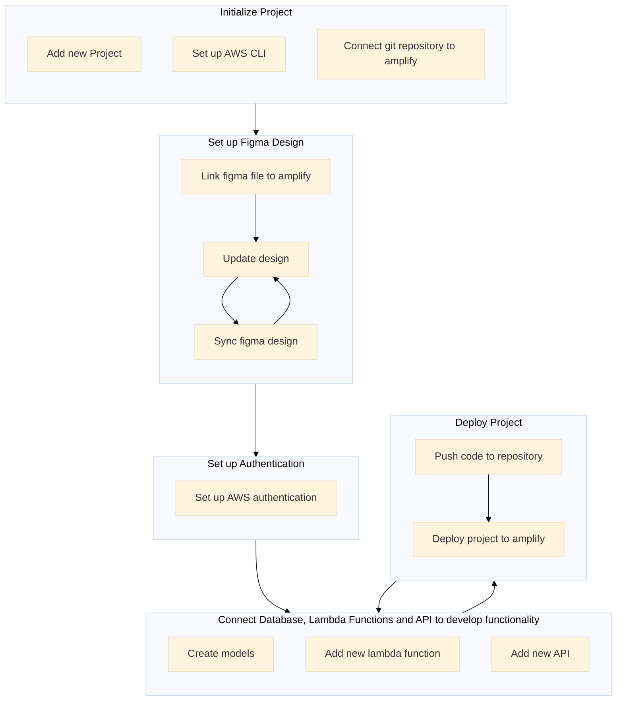
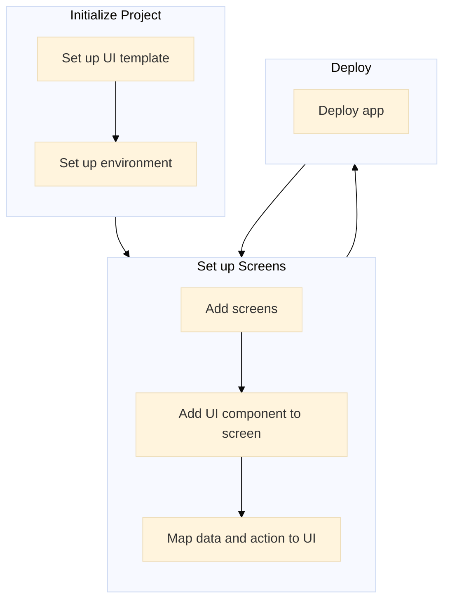

## Amplify

### Features
1. ```Authentication - It is straightforward to create onboarding flows with a fully managed user directory and pre-built sign-up, sign-in, forgot password, and multi-factor authorization workflows with AWS Amplify. It also supports logging in through social media tools like Facebook, Google, or log in with Amazon. Fine-grained access control to mobile and web applications is also present, which is powered by Amazon Cognito. ```
2. ```Manage User - ```
3. ```Datastore```
4. ```API (GraphQL, REST)```
5. ```Functions```
6. ```Manage Content```
7. ```Storage - With Amplify, it is now possible to safely store and manage content generated by users including photos or videos on your device or cloud. It offers a simple mechanism for managing user content in three different types of warehousing buckets — public, protected or private.```
8. ```Analytics - AWS Amplify can be used for auto-tracking to track user sessions and analytics webpage metrics. You can collect data streams and analyze data in real-time to build robust marketing strategies that increase the adoption, commitment and retention rate of customers. The Amazon Pinpoint and Amazon Kinesis power this capability.```
9. ```Monitoring```
10. ```CI/CD```
11. ```PR Previews```
12. ```Push Notifications - In AWS Amplify, marketing and analytics skills allow you to better target customers. The adjustment of your content is now possible, and the communication is supplied via Amazon Pinpoint via multiple channels such as e-mail, texts and push notifications.```
13. ```Managed hosting```
14. ```Custom Domanins```

### Developemnt Support
1.  ```Javascript```
2.  ```React```
3.  ```Angular```
4.  ```Vue```
5.  ```Next.js```
6.  ```React Native```
7.  ```Flutter```
8.  ```Ionic```
9.  ```Android```
10. ```iOS```


### Pros and Cons
| Pros | Cons |
|----------|:-------------:|
| Getting Started Quickly - Very rapid prototyping and quick application development  |  Higher Learning Curve - lots of time spent on learning the platform rather than coading |
| Fast Development Cycles |  Collaboration is difficult - Larger team find difficulty while developing application together |
| Shielding From the Complexity of AWS - It configure most of required aws services automatically | To much background services - Amplify have lage client side libraries which results in lots of extra lines of code |
| Free to Start - initially most of the amplify services are under the free tire of aws | As it is a managed service you do not have control over resources result in higher Bills |
| All the routing and domain configuration are managed | Poor traffic distribution - You cannot use load balancers, results in bottleneck at management of traffic spikes and latency problems. |
| New feature introduction every few months | Consistent changes needs consistent learning |
| Web-Based Analytics - AWS Amplify comes with a web-based analysis Dashboard for developers, designers, and project managers. | Bugs - As service is quite new it have lots off bugs |
| Multi programming language support - Javascript, React, Angular, Vue, Next, React, Flutter, Ionic, Android, iOS | Datastore uses Dynamodb - Dynamodb is very stiff and not suitable for every web application |
| Easy to Deploy - CI/CD pipeline can be setup to automate the deployment process |  |

### Work Flow


---

## DronaHQ

### Features
1. ```UI Builder```
2. ```Authentication```
3. ```Database Support```
4. ```API Support```
5. ```Third Party Service Integration```
6. ```Easy Deployment```
6. ```Self Hosted```

### Developemnt Support
1. ```Web```

### Pros and Cons
| Pros | Cons |
|----------|:-------------:|
| User friendly UI builder | slow responsiveness and freezing |
| Lots of UI components | Difficult to add custome design |
| Third party service integration | Third party apps need to configured outside this platform |
| Self hosted |  |
| Feature rich | Difficult to add custome feature |
| Support available for 24/7 | Poor documentation and very small developer community |
| Good to develop internal tools like dashboard | UI intensive application development is difficult |

### Work Flow
